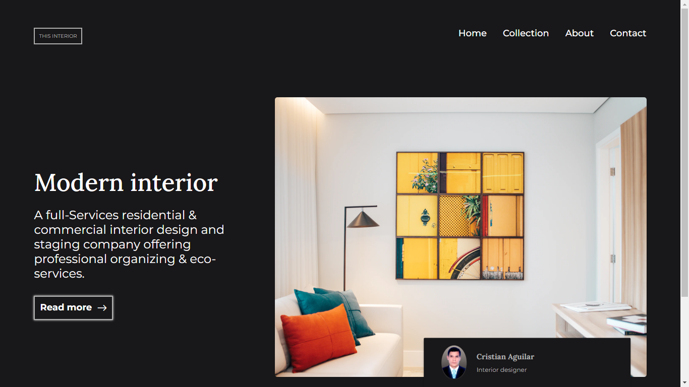

# DevChallenges Interior Consultant - Solución

Esta es mi solución al desafío [Interior Consultant](https://devchallenges.io/challenges/Jymh2b2FyebRTUljkNcb) en DevChallenges. DevChallenges es una plataforma que permite mejorar tus habilidades de desarrollo web mediante la construcción de proyectos del mundo real.

## Descripción General
### Captura de Pantalla de mi Solución

Comparto mi solución para el proyecto "Interior Consultant" de DevChallenges. El objetivo de este proyecto era crear una página web responsiva para un consultor de interiores, siguiendo el diseño proporcionado.

## Desafíos

**Diseño Responsivo**: Adaptar la página web para que se vea y funcione de manera óptima en una variedad de tamaños de pantalla fue un desafío importante. Utilicé consultas de medios y CSS personalizado para lograr una experiencia de usuario coherente en dispositivos de escritorio, tabletas y teléfonos móviles.

**Menú Hamburguesa**: Implementar un menú hamburguesa que se ocultara inicialmente en pantallas más grandes y se activara al hacer clic en el botón de hamburguesa fue un desafío técnico. Utilicé propiedades CSS como `position`, `transform`, y `transition` para lograr la animación suave y el comportamiento deseado.

## Enlaces

- [Solución en GitHub](https://github.com/CristianAguilar-dev/Interior-Consultant-devchallenges.io)
- [Ver sitio en vivo](https://cristianaguilar-dev.github.io/Interior-Consultant-devchallenges.io/)

## Herramientas Utilizadas

- HTML5
- CSS3
- Google Fonts
- Diseño Responsivo

## Desarrollo Paso a Paso

1. **Evaluación del Desafío**: Comencé revisando los detalles del desafío en DevChallenges para comprender los requisitos y el diseño proporcionado, con la herramienta de diseño figma.

2. **Estructura HTML**: Creé la estructura básica de la página utilizando etiquetas HTML5 semánticas para organizar el contenido de manera significativa.

3. **Estilos CSS**: Luego me enfoqué en aplicar estilos personalizados de CSS3 para establecer colores, tamaños, tipografía y espaciados coherentes en todo el diseño.

4. **Diseño Responsivo**: Siguiendo el enfoque "mobile-first", aseguré que la página fuera responsiva utilizando consultas de medios y ajustando los estilos según fuera necesario para diferentes tamaños de pantalla.

5. **Menú Hamburguesa**: Implementé un menú hamburguesa que se ocultara en pantallas más grandes y se mostraría al hacer clic en el botón de hamburguesa. Logré esto utilizando propiedades CSS como `position`, `transform`, `transition`, y ajustando la visibilidad con consultas de medios.

### Desafío del Diseño Responsivo

Uno de los mayores desafíos fue garantizar que la página se viera y funcionara de manera óptima en dispositivos con diferentes tamaños de pantalla. Utilicé consultas de medios para modificar los estilos y el diseño en función del ancho de la pantalla, lo que requirió pruebas exhaustivas en diferentes dispositivos y el doble del tiempo esperado.

### Construido con

- [HML5](https://developer.mozilla.org/es/docs/Web/HTML)
- [CSS3](https://developer.mozilla.org/es/docs/Web/CSS)
- [Responsive Design](https://developer.mozilla.org/es/docs/Glossary/Responsive_web_design)
- [Google Fonts](https://fonts.google.com/)

## Lo que Aprendí

Este proyecto me permitió mejorar mis habilidades de diseño y desarrollo web, así como mi comprensión de cómo crear páginas web que funcionen en una variedad de dispositivos. Aprendí a utilizar consultas de medios y propiedades CSS para lograr un diseño responsivo y cómo crear un menú hamburguesa animado.

## Desarrollo Continuo

Continuaré practicando y mejorando mis habilidades de desarrollo web, explorando nuevas tecnologías y aprendiendo más sobre la creación de experiencias de usuario efectivas.

## Reflexión

Este desafío de DevChallenges ha sido una experiencia de aprendizaje valiosa. Cada proyecto es una oportunidad para crecer como desarrollador web y enfrentar nuevos desafíos.

## Autor

- [Perfil en DevChallenges](https://devchallenges.io/portfolio/CristianAguilar-dev)

## Agradecimientos

Agradezco a DevChallenges por proporcionar desafíos emocionantes y a la comunidad por su apoyo y retroalimentación constructiva.
